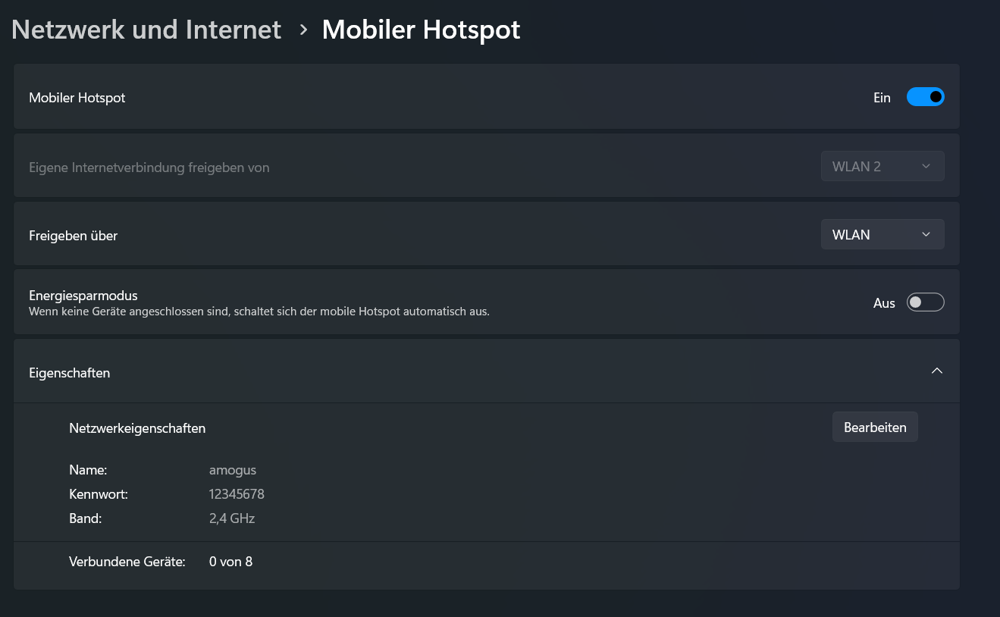

# EvoScan

- Laptop mit WLAN verbinden und an dem einen mobilen Hotspot einrichten(Name und Passwort ist egal) und anschalten:



- SD Karte vom Pi am PC anschließen und eine Datei `wpa_supplicant.conf` (genau so!) erstellen mit dem Inhalt (WLAN-NAME und WLAN_PASSWORT ersetzen):
```
network={
   ssid="WLAN-NAME"
   psk="WLAN-PASSWORT"
}
```

- SD Karte wieder an PI anschließen und PI anschalten, er sollte sich jetzt mit dem Hotspot verbinden und bei Verbundene Geräte sollte 1 von 8 stehen, dort könnt ihr die IP-Adresse vom PI auslesen (vielleicht geht auch evoscan.local)

- In Visual Studio Code die SSH-Remote Erweiertung installieren (falls noch nicht geschehen) und unten links auf dieses Zeichen drücken:


- -> `Connect to Host...` -> `Add New SSH Host...` und da `ssh pi@IP_ADRESSE_VOM_PI`eingeben (vielleicht auch `evoscan@IP_ADRESSE_VOM_PI`)

- Mit dem PI über `Connect to Host...` verbinden, es sollte ein Fenster kommen wo ihr das Passwort eingeben müsst


- Die Dateien könnt ihr einfach beim Laptop in das VSCode Fenster ziehen und dann sollten die auf den PI geladen werden

- Ein Terminal im Ordner mit den Dateien öffnen und dort eingeben
```bash
pip install flask
```
```bash
python server.py
```

- Die Webseite sollte man jetzt im Browser über `http://IP_ADRESSE_VOM_PI:5000` öffnen können
´
- Wenn ihr das auch auf dem Handy machen wollt müsst ihr euch nur mit dem Hotspot verbinden

- Die Tags könnt ihr beschreiben indem ihr
```bash
python sensors.py
```
ausführt und dort den Namen eintragt